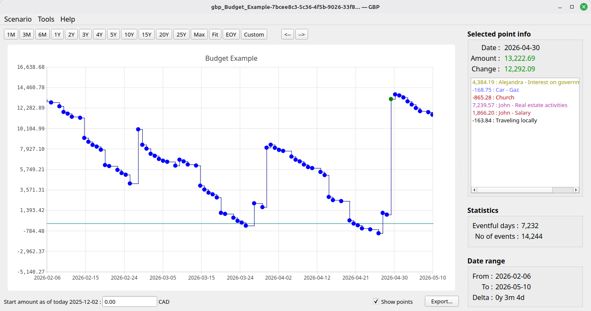
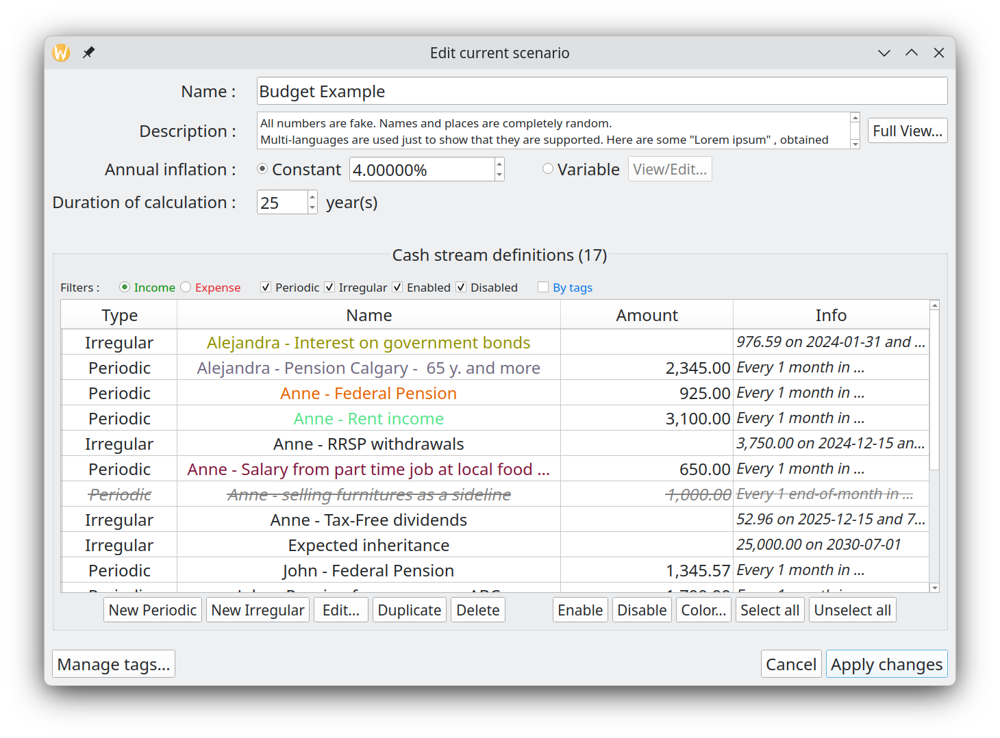
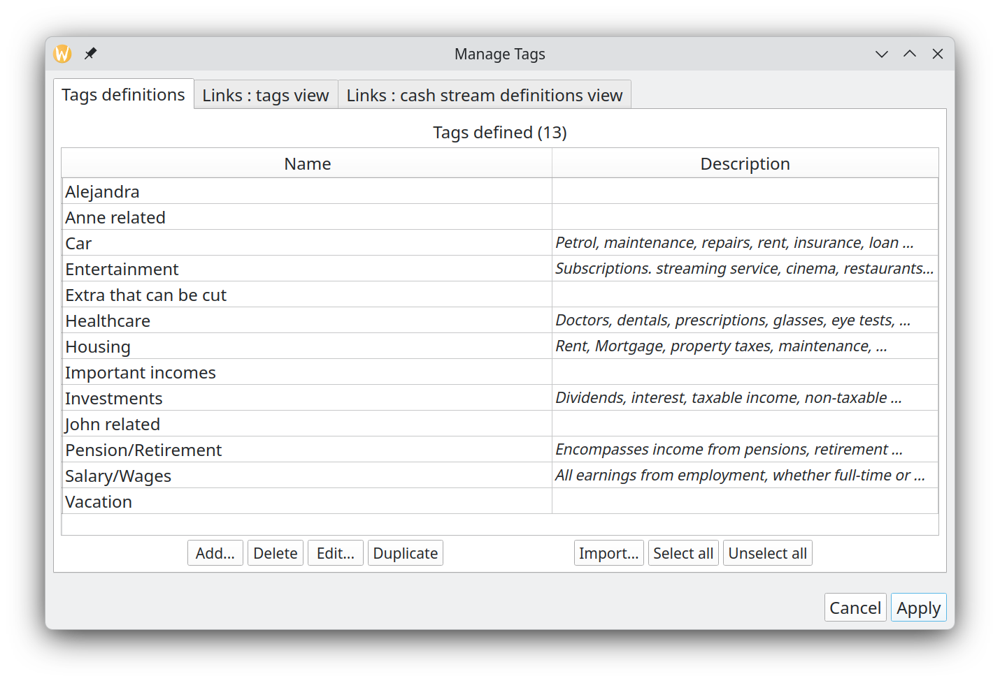
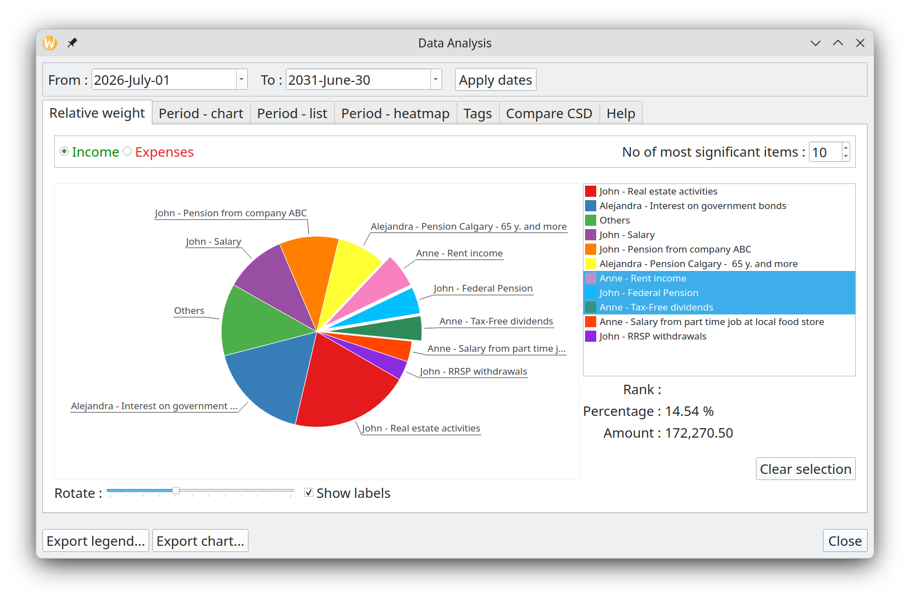
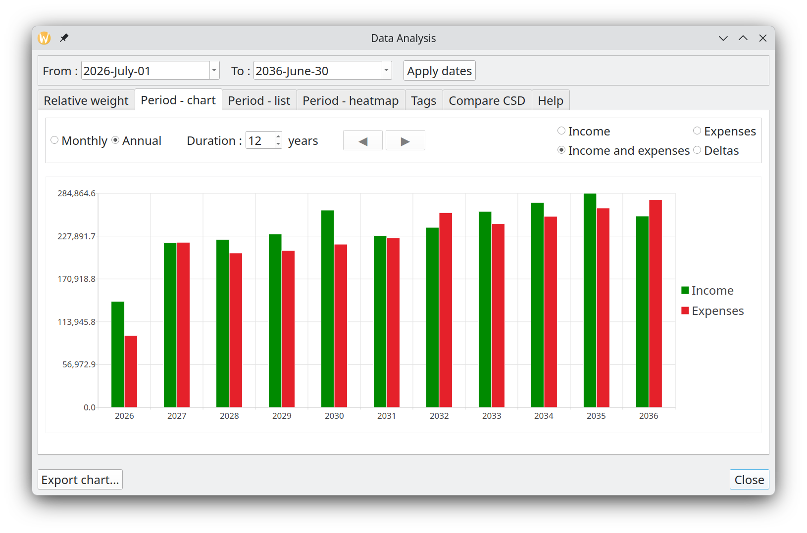
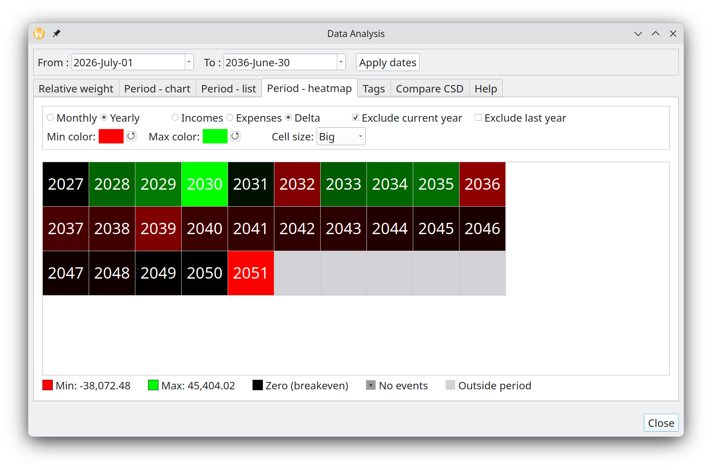

# graphical-budget-planner

## What's new ?

Version **1.8.1** is out (29 August 2026) ! This is a **bug-fix release**, with addition of a French user manual and quick tutorial, making gbp French support complete (English is the default language and will always be). Here are the main changes compared to 1.8.0 (see CHANGELOG for details) :

- **Installation simplified** : On Linux, GBP no longer requires a separate installation of the FUSE 2 library (`libfuse2`) as a prerequisite.

- **Full French translation for bundled documentation** : the User Manual and Quick Tutorial are now available in French, in addition to English which is the default.

- **Dynamic column sizing** : table columns in several dialogs (Edit Irregular Financial Stream Definition, Edit Scenario, Manage Tags, Edit Variable Growth, Analysis — Tags tab) now resize themselves to fit their actual content, instead of relying on a fixed estimate made once at startup. This fixes long content getting truncated with an ellipsis on some platform/locale combinations — most visibly a German long-format date on Windows, where the fixed estimate didn't leave enough room for the font actually used there.

- **Better support for international locales** : numbers and dates across the app are now more consistently rendered in the application's actual locale — including locales with their own numbering system (e.g. Bengali or Arabic digits), where several places had been silently falling back to plain Western digits or picking up formatting that doesn't belong on an identifier (like a thousands separator on a year).

- In **Custom Date Interval dialog :**
  
  - **Custom date interval (chart) remembers your last selection** : the "Custom" chart range dialog no longer resets its "From"/"To" dates to the chart's current view every time it is opened ; your previous selection is kept instead, and only adjusted if it falls outside what the loaded scenario can actually calculate.

## Screenshots

The Main window



Editing a scenario



Managing tags



Analysis - Relative weight of incomes/expenses



Analysis - Annual Report Chart



Analysis - Heatmap



## Installation

### On Linux

GBP is distributed as an “AppImage” on Linux platform, which is a single-file executable packaging format allowing a program to run on many Linux distributions. There is nothing else to install in most cases. After downloading the most recent AppImage application from https://github.com/redmoon1945/gbp/releases, user has to enable “executable” permission on the file and it is ready to be launched. 

###### **Lunduke Computer Operating System (LCOS) case**

As of sept 2026, LCOS 0.2 is still an alpha version, intended for testing only, it will probably greatly evolve in the coming months. You have to install FUSE 3 to execute an AppImage file like gbp. 

`sudo apt install fuse3`

gbp works well, even if there are several minor "warning messages" written to the console, all related to what is or is not implemented at this stage in LCOS.

###### NixOS case

NixOS does not use the traditional Linux filesystem layout (no `/lib64`, no FHS-style directories) that AppImages expect, so the GBP AppImage will **not** launch directly, even after setting the executable permission. Running it as-is typically fails with an error such as `cannot execute binary file`.

To run the GBP AppImage on NixOS, you have two options :

* **One-off / try it out** : run it through `appimage-run`, without installing anything permanently :
  
  `nix-shell -p appimage-run --run "appimage-run ./gbp-x.y.z.AppImage"`

* **Permanent fix (recommended)** : enable AppImage support system-wide by adding this to your `configuration.nix`, then running `sudo nixos-rebuild switch` :
  
  ```nix
  programs.appimage = {
    enable = true;
    binfmt = true;
  };
  ```
  
  Once enabled, AppImages (including GBP's) can be launched directly, e.g. `./gbp-x.y.z.AppImage`, or by double-clicking them in a file manager, just like on any other distribution.

Note that GBP's configuration and log files are stored under the standard XDG user directories (`~/.config` and `~/.local/share`), so they behave normally on NixOS regardless of how the AppImage is launched.

### On Windows®

Download the ".zip" file binary from the repository mentioned above and unzip it in the folder of your choice. Launch gpb.exe to execute GBP.

## Supported Platforms and Languages, System Requirements

GBP is intended to be run first and foremost on the Linux Operating System. But since it is built using the Qt cross platform toolkit, a version of GBP for the Windows® Operating System is also provided and fully tested. A version for MAC could be easily produced if requested.

GBP does not use a lot of RAM (typically between 25 and 250 MB, depending on the scenario) and necessitate roughly 50 MB of disk space (not taken into account the scenario files that you will create and GBP log files, which are all pretty small anyways).

As of september 2026, GBP has been extensively tested on the following platforms : 

* **Kubuntu 26.04 LTS**, KDE 6.6.4, Wayland, Kernel 7.0.0-22
* **Linux Mint** Debian Edition 7, Cinnamon 6.4.13, X11, Kernel 6.12.94
* **Windows® 11** Home Edition

It has also been tested, but not as extensively, on the following platforms :

* LCOS 0.2, XFCE 4.20, Libre X11, Kernel 6.12.101
* MX linux 25, XFCE 4.20.1, X11, Kernel 6.16.12
* Fedora 43, KDE Plasma 6.6.5, Wayland, Kernel 7.0.11-100
* OpenMandriva Lx 5.0, X11, KDE Plasma 5.27.9, kernel 6.6.2
* Ubuntu 24.04.04 LTS, Gnome 46, Kernel 6.7.0-35
* Ubuntu 22.04.5 LTS, Gnome 42.9, X11, Kernel 6.8.0-52
* Ubuntu 22.04.5 LTS, Gnome 42.9, Wayland, Kernel 6.8.0-52

GBP supports English and French languages. By default, English is used, but if the host Operating System is in French (whatever the country), then GBP will switch to French. More languages will hopefully be added in the future, if resources to translate are available.

A mouse is required to use the software. A screen resolution of **1650 x 1080** or better is required.

## License, Disclaimers and Source Code Repository

Graphical Budget Planner (a.k.a graphical-budget-planner or GBP or gbp) is a totally free and open source Qt desktop application intended to ease significantly the process of creating, maintaining and analyzing a personal budget. It does NOT connect to internet whatsoever.

This application and all its source code are licensed under the GNU Affero General Public License version 3 or later (AGPL-3.0-or-later). It's Free Software. See https://www.gnu.org/licenses/#AGPL/

Software repository for GBP can be found at : 
https://github.com/redmoon1945/gbp

Being built with the Qt toolkit, GBP is subject to the Qt terms and conditions : see qt.io/licensing

Credits : 

* Tobias Leupold : code to calculate difference between 2 dates -> see https://nasauber.de/blog/2019/calculating-the-difference-between-two-qdates/

## Usage

See the detailed User Manual to get in depth information about this application : gbp/doc/Graphical Budget Planner - User Manual.pdf 

Graphical Budget Planner (GBP) is an open source Qt desktop application intended to ease significantly the process of creating, maintaining and analyzing a personal budget. It allows the following :

* See graphically the evolution of your cash balance through time, at any given moment in a period covering the next 100 years !
* Easy zooming and/or panning
* Specify painlessly all your forecasted income/expense budget items, with flexibility to define periodic or irregular flow of incomes/expenses.
* Optionally define inflation, either as a constant value or a complex series of changing values.
* Optionally define a custom monthly growth pattern for any income/expense specification , expressed either as a constant value or a complex series of changing values.
* Perform automatically different types of analysis on your data, like relative weight of incomes/expenses over custom period, monthly and yearly reports.
* Optionally convert all amounts to Present Values using a user-defined discount rate in Option Dialog. 
* Your data is not locked in : all scenarios are in open JSON format, and resulting data are exportable in CSV format.
* Fully support UNICODE in all text fields.

GBP is all about CASH BALANCE **FORECASTING** : the key principle adopted in the design of the software is to take into consideration only the **FUTURE** incomes/expenses expected to occur (so the "forecasts"), starting “tomorrow”, “today” being the system date when the application has been launched. **GBP does NOT track past incomes / expenses**...Consequently, this is not the right application if you want know how and when your money has been earned/spent in the past (that is, tracking your incomes/expenses made "before today"). 

## Building GBP

If you want to build yourself the application for Linux and not use the provided binaries in the "Releases" folder, see the Building.md